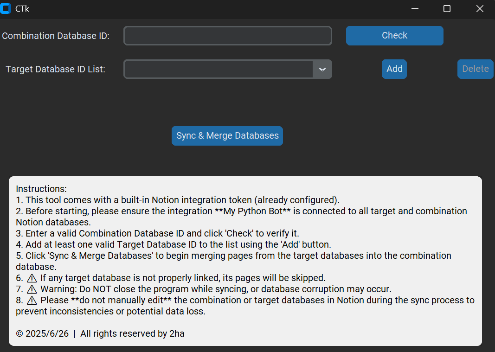

# Notion-Automerge

A Python-based desktop application that **automatically merges multiple Notion databases** into a single unified
combination database. Ideal for personal data management, productivity workflows, and learning Notion API integration.

---

## Features

* Automatically sync pages from multiple target databases into a main combination database
* Automatically create `relation` fields based on source database titles
* Remove unlinked (orphaned) pages
* Log warnings, errors, and sync activity to local files
* Modern GUI built with `customtkinter`
* Modular codebase for maintainability and future extension

---

## GUI Preview



> GUI application is located in the `final_app/` directory.

```bash
python final_app/ui_app.py
```

With the GUI, you can:

* Select source and combination databases
* Trigger sync with a single click
* View real-time status logs in the `logs/` folder (`error.log`, `info.log`)

---

## 📽 Demo Video

[](https://youtu.be/Wv_3Vw6b-vk)

---

## Project Structure

```
notion-automerge/
├── final_app/         # GUI and synchronization controller
├── notion_utils/      # Notion API utility modules
│   ├── relate_databases_to_one/   # Core logic for merging databases
│   │   ├── relate_databases_add_new_target_database.py
│   │   ├── relate_databases_format.py
│   │   ├── relate_databases_search.py
│   │   └── relate_databases_to_one_update.py
│   ├── cache.py       # Caching for faster API responses
│   ├── client.py      # Initializes Notion client
│   ├── create_database.py, create_page.py
│   ├── internet_check.py
│   ├── log.py
│   ├── operate_json.py
│   ├── search_database.py, search_page.py
│   ├── update_database.py, update_page.py
├── phase/             # Learning and test scripts from Phase 1 to 5
├── .gitignore
├── README.md          # ←←← ← This file
└── requirements.txt
```

---

## Setup Instructions

1. Clone this repository
2. Create a `.env` file with your Notion integration secret:

```env
NOTION_TOKEN=secret_XXXX
DEBUG=true
```

3. Install dependencies

```bash
pip install -r requirements.txt
```

---

## Module Descriptions (`notion_utils/`)

* `client.py`: Creates the Notion client using `.env` values
* `cache.py`: Adds caching to page and database queries
* `search_database.py`, `search_page.py`: Validate and retrieve page/database info
* `update_database.py`, `update_page.py`: Edit structure and content of properties
* `log.py`: Print and store logs
* `internet_check.py`: Check internet connectivity
* `operate_json.py`: Save responses to JSON (for debugging)
* `create_database.py`, `create_page.py`: Create Notion databases/pages
* `relate_databases_to_one/`: Core logic to integrate multiple databases:

    * Build relation fields dynamically
    * Normalize database schemas
    * Sync and filter pages from source databases

---

## Learning Journey

See the [`/phase`](./phase) folder for all five stages of learning and experimentation.
Each phase includes:

* Goal and motivation
* Exercises
* Test scripts
* Reflections and design decisions

Development summary:

| Phase | Topic               | Description                                   |
|-------|---------------------|-----------------------------------------------|
| ✅ 1   | Reading data        | Fetch content using Notion SDK                |
| ✅ 2   | Creating pages      | Understand Notion page format and fields      |
| ✅ 3   | Updating/Deleting   | Modify page titles and fields                 |
| ✅ 4   | Unconditional merge | Sync all pages from A/B into C                |
| ✅ 5   | Conditional merge   | Avoid duplicates, add relations, unify schema |

---

## Motivation

This tool was built during my summer break to practice:

* Using a real-world RESTful API (Notion)
* Designing clean and modular Python code
* Implementing logs, caching, and error handling in production scripts
* Building a productivity-enhancing GUI tool

---

## Development Reflections

### Why build this?

While using Notion for CS learning, I wanted a "master view" to aggregate all learning content. However, Notion doesn’t
support automatic merging or linking across databases. Manual setup is time-consuming.

So, I created this one-click merge tool to solve that need while learning Python, APIs, and automation.

### Goals & Growth

This was my first serious Python project, where I learned:

* API usage and error management
* JSON data handling and parsing
* `.env`, `pip`, `requirements.txt` usage in Python engineering
* Writing modular, readable code with logs
* Using git for version control and project structure

I now understand how software engineers build, maintain, and showcase real-world tools.

### Main Challenges

1. **Learning Notion API**: Complex structure and field types made debugging difficult.
2. **First-time GUI work**: Learned `customtkinter` from scratch (events, layout, validation).
3. **Merge logic**: Handled corner cases like duplicate relations, conflicting fields, and API failures.
4. **Debugging**: Developed phase-based debugging and logging tools to catch and fix issues.

### How I Solved Them

I broke the problem into 5 learning phases, each focused on a manageable goal. By reading docs, watching tutorials, and
using AI assistants, I iteratively refined my codebase.

### Future Directions

This project made me realize I enjoy building real tools with good UX and technical foundations. Though features like
undo or version history are not included yet, I have plans:

* Display sync logs inside the GUI
* Show time taken per sync
* Improve GUI layout and usability
* Refactor and simplify error handling
* Consider releasing `.exe` for non-technical users

---

## License

MIT License. Feel free to fork and adapt for your own Notion workflows.

---

## Contact

Author: **PO-YI LIN**
If you're an interviewer or collaborator, feel free to reach out via GitHub.
